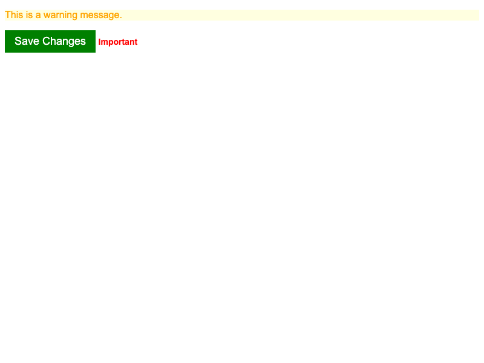

# Fix Rule Order

When two CSS rules have the **same specificity**, the cascade falls back to **rule order** — whichever rule appears last in the stylesheet wins.

Both the HTML and CSS files are filled out for you. Your job is to fix the cascade issues by editing the CSS file. You can add, remove, or edit selectors, or move declaration blocks around. **You should not edit the HTML file or any of the actual style values in the CSS**.

## Desired Outcome

- The warning paragraph should have **orange text** on a **light yellow background**.
- The save button should have a **green background** with **white text** at **18px**.
- The "Important" label should be **red and bold**.

### Self Check

- Did you make sure to not edit the HTML file?
- For elements with two classes, does the intended class win because its rule comes last?
- Did you avoid changing any property values?
