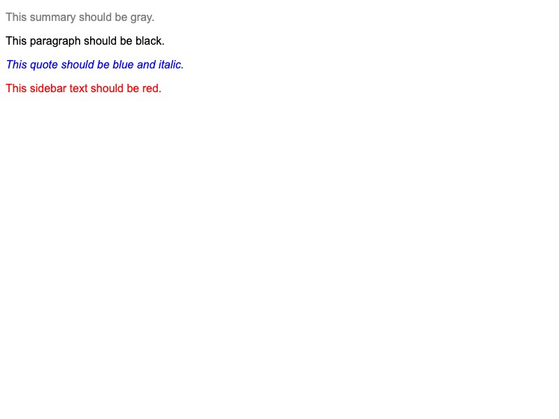

# Fix Inheritance

Some CSS properties like `color` and `font-style` are **inherited** by child elements. However, a rule that **directly targets** an element always beats an inherited value — even when the inherited value comes from a more specific parent selector.

Both the HTML and CSS files are filled out for you. Fix the cascade issues by editing the CSS file only. You can add, remove, or edit selectors, or move declaration blocks around. **You should not edit the HTML file or any of the actual style values in the CSS**.

## Desired Outcome

- The summary paragraph should be **gray**; the other article paragraph should be **black**.
- The quote paragraph should be **blue and italic**; the other sidebar paragraph should be **red**.

### Self Check

- Did you make sure to not edit the HTML file?
- Are the child elements being directly targeted with enough specificity?
- Did you avoid changing any property values?
