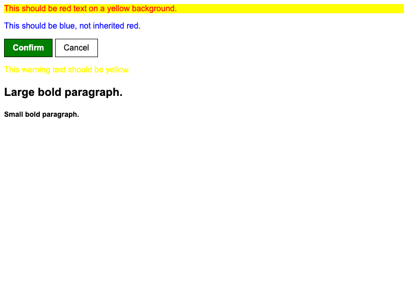

# Fix the Cascade (Mixed)

This capstone exercise combines every cascade concept from this section: **specificity**, **selector count**, **inheritance**, and **rule order**. Some elements have more than one issue to untangle.

Both the HTML and CSS files are filled out for you. Fix the cascade issues by editing the CSS file only. You can add, remove, or edit selectors, or move declaration blocks around. **You should not edit the HTML file or any of the actual style values in the CSS**.

There are multiple ways to solve each issue, so check the solution file for alternative approaches.

## Desired Outcome

- The `#subsection` element should have **red text** on a **yellow background**.
- The child paragraph should be **blue**, not inherited red.
- The confirm button should be **green with white, bold text**; the cancel button should remain the default white style.
- The warning paragraph should have **yellow text**.
- The large paragraph should be **22px bold**; the small paragraph should be **14px bold**.

### Self Check

- Did you make sure to not edit the HTML file?
- Did you consider all four cascade factors before making each fix?
- If you added selectors, do they target valid HTML elements?
- Did you avoid changing any property values?
